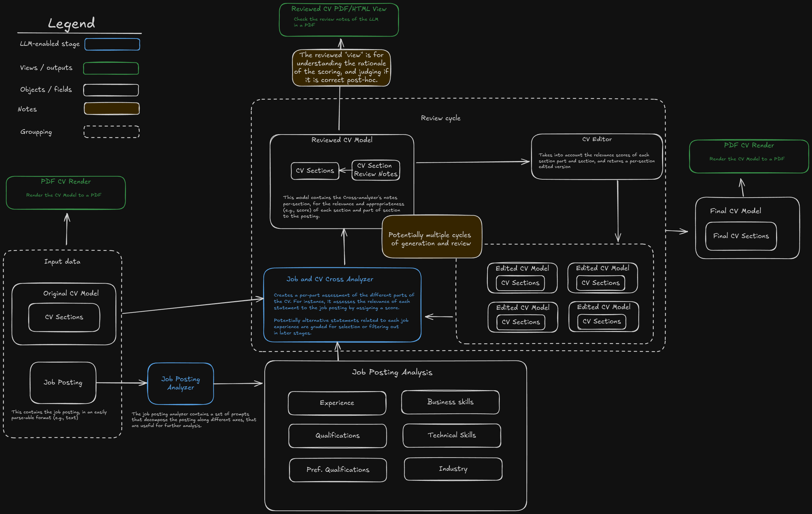

# auto_cv
The `auto_cv` project is a LLM ("GenAI")-enabled CV customizer. 

Given a job posting and a CV, the system creates a rendered file that
contains the parts of the experience of the CV candidate that are the most relevant and aligned with the provided posting. 

The system architecture diagram is as follows:



## Enable Gemini 
For getting a Gemini API key one needs to 
1. Create a GCP project (if it does not exist already) [console.google.com](console.google.com)
2. Create an API key [here](https://aistudio.google.com/app/apikey)


## Ollama context window
Some of the authoring tasks (e.g., personal statement or cover letter), may benefit from having a very large context window.
This is mainly an issue for local models with ollama. 
Ollama by default has only ~2k context window, which needs to be changed in order to allow for lengthier inputs. 
You can inspect the actual context window of the running ollama server by running 

```
ps aux| grep ollama # check the --ctx-size flag
```

to change you need to create a "new" model, which can be done interactively with commands like bellow:
```
ollama run llama3
>>> /set parameter num_ctx 4096
>>> /save llama3-4k
>>> /bye
```

or by defining and setting a new model file.

## Running with OpenTelemetry tracing
It may be helpful to use open telemetry to get statistics about the runtimes, the errors, and intermediate outputs from the chains run. 
There is an automatically instrumented `autocv-otel.py` file you can use for that. 


